<p align="center">
  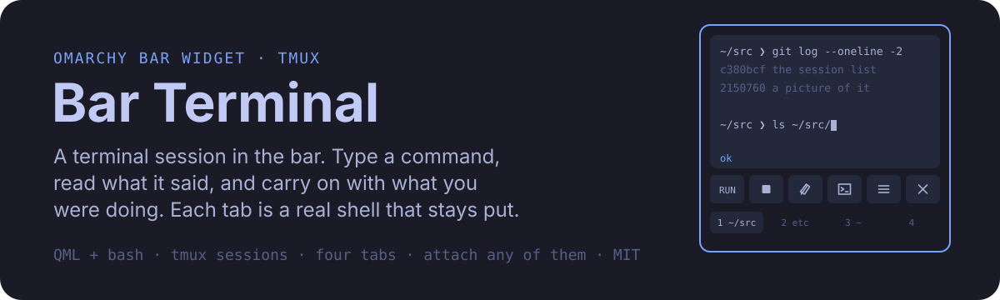
</p>

<p align="center">
  
  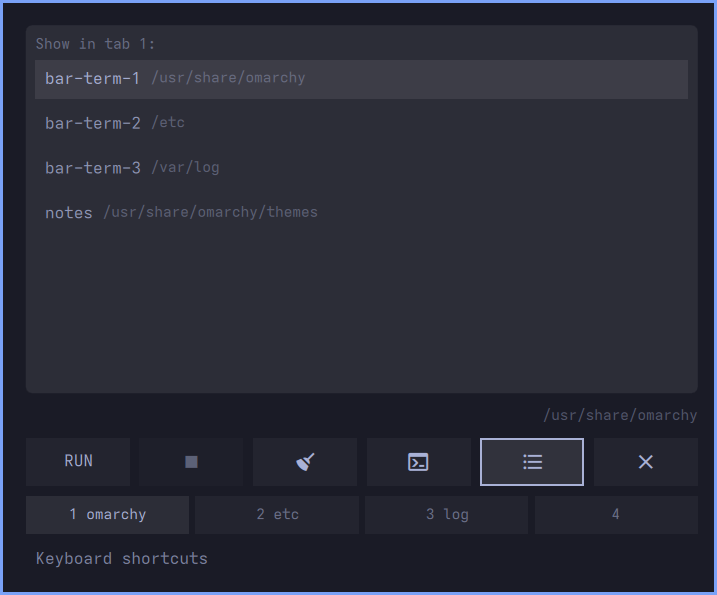
  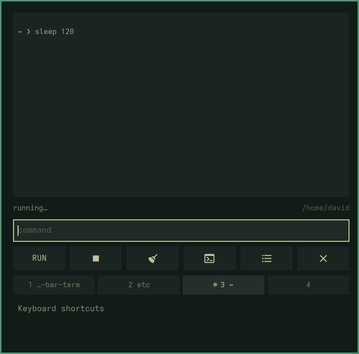
</p>

<p align="center">
  <sub>As it opens · choosing which session a tab shows · something running in another tab</sub>
</p>

tmux sessions in the Omarchy bar, for the things not worth opening a window for: a
`git log`, a `df -h`, a `ps aux`. Each tab is a real session, so it behaves like
the terminal it is. `cd` sticks, the environment stays, and the session
outlives the widget: restart the shell, or log back in tomorrow, and your tabs are where
you left them.

<p align="center">
  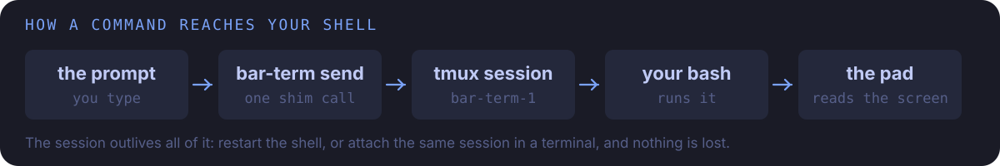
</p>

It draws itself in whatever Omarchy theme you are running. Every colour comes from the
bar, so there is nothing to configure and nothing to keep in step:

<p align="center">
  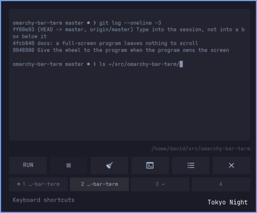
</p>

<p align="center">
  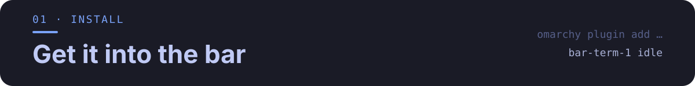
</p>

<a name="requirements"></a>
<p align="center">
  
</p>

- Omarchy with the Quickshell-based shell (`omarchy-shell`)
- `tmux`, which is what each tab actually is
- `omarchy-launch-terminal`, for opening a session in a terminal window

<p align="center">
  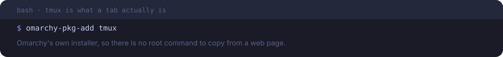
</p>

```bash
omarchy-pkg-add tmux
```

<a name="one-command"></a>
<p align="center">
  
</p>

<p align="center">
  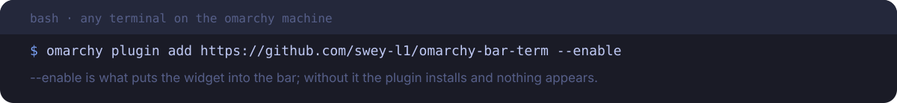
</p>

```bash
omarchy plugin add https://github.com/swey-l1/omarchy-bar-term --enable
omarchy restart shell
```

To remove it:

```bash
omarchy plugin remove io.github.swey-l1.bar-term
```

Removing the plugin leaves your tmux sessions alone; they are yours, not the widget's.
`tmux kill-session -t bar-term-1` if you want them gone.

<p align="center">
  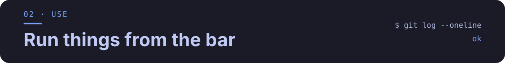
</p>

Click the icon in the bar and type. The pad has the keyboard as soon as it opens and your
keys go straight into the session, so it behaves like the terminal it is showing: there is
nothing to click first, and nothing to learn that you did not already know.

<a name="keyboard"></a>
<p align="center">
  
</p>

<p align="center">
  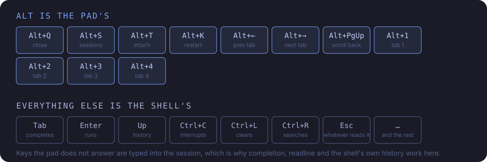
</p>

<details markdown="1">
<summary>Every binding, as text</summary>

**The pad's keys.** Alt, and Escape.

| Key | What it does |
|---|---|
| `Alt+S` | Show another session in this tab |
| `Alt+T` | Attach this session to a terminal |
| `Alt+K` | Restart this session |
| `Alt+Left` `Alt+Right` | Previous and next tab |
| `Alt+1` … `Alt+4` | Jump to a tab |
| `Alt+PgUp` `Alt+PgDn` | Read back through the pad's scrollback |
| `Alt+Q` | Close the pad |

**Everything else is the shell's**, typed into the session as you press it. `Tab`
completes, `Enter` runs, `Up` walks *bash's* history, `Ctrl+R` searches it, `Ctrl+C`
interrupts, `Ctrl+L` clears, `Ctrl+W` kills a word, and `Escape`, `PageUp` and `PageDown`
are whatever the thing you are running makes of them. There is no line editor of the widget's own to be worse than
the one you already have.

Closing is `Alt+Q`, the bar icon, or whatever hotkey you bound, not `Escape`: a terminal
that swallows `Escape` is no use for most of what gets run in one.

The buttons under the screen do the common ones for you, and are the half you do not have
to remember. The broom does slightly more than `Ctrl+L`: the key clears the shell's screen,
the button drops the pad's scrollback with it.

</details>

<a name="tabs"></a>
<p align="center">
  
</p>

<p align="center">
  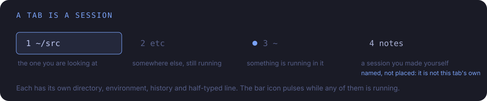
</p>

<details markdown="1">
<summary>What each tab keeps</summary>

Its own directory, environment, command history and half-typed line -- all of them the
session's rather than the widget's, so switching away and back puts you exactly where you
were, and so does closing the pad, restarting the shell, or attaching in a terminal.

A tab is labelled with the last part of its directory, shows a pulsing dot while something
is running in it, and turns the urgent colour if that something failed while you were
looking elsewhere. The bar icon pulses while *any* tab is running, which is the one thing
the bar can tell you that the pad cannot.

`Alt+K` throws a session away and starts it again, for when one has been left in a state
you would rather not untangle.

</details>

<a name="sessions"></a>
<p align="center">
  
</p>

`Alt+S`, or the list button in the key row, shows every tmux session on the server,
whoever made it, and points the current tab at the one you pick. A session you started in
a terminal this morning shows up in the bar with its scrollback intact, and typing in the
pad types into it.

<details markdown="1">
<summary>What a borrowed session does and does not get</summary>

A tab showing a session it did not make says so: it is labelled with the session's name
rather than its directory, and the name appears beside the prompt. Picking the tab's own
`bar-term-<n>` again puts it back. The choice is kept in `shell.json`, so it survives a
restart.

It gets no exit status, because that comes from an rc file only sessions this widget
started are running; the result line stays blank rather than lying. And it is not
disposable: `Ctrl+K` will still restart it if you ask, so read the name before you press
it.

</details>

<a name="attaching"></a>
<p align="center">
  
</p>

`Alt+T` opens a terminal window attached to the session you are looking at, not a new
shell: the window comes up showing exactly what the pad was showing, half-finished command
and all. The pad closes as it goes, because it covers the screen and the new window would
otherwise open behind it. Closing that window detaches; the session, and everything
running in it, carries on.

<p align="center">
  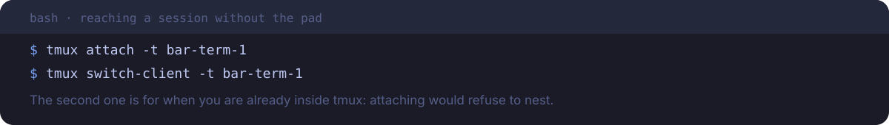
</p>

<details markdown="1">
<summary>Reaching a session without the pad</summary>

```bash
tmux attach -t bar-term-1        # from any terminal
tmux switch-client -t bar-term-1 # from inside another tmux session
```

`attach` refuses from inside tmux (*sessions should be nested with care*). `switch-client`
is the one you want there: it is the same server, so your client just moves.

</details>

<a name="optional-hotkey"></a>
<p align="center">
  
</p>

<p align="center">
  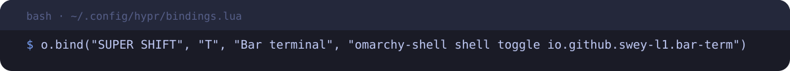
</p>

<details markdown="1">
<summary>The line to add</summary>

```lua
o.bind("SUPER SHIFT", "T", "Bar terminal", "omarchy-shell shell toggle io.github.swey-l1.bar-term")
```

</details>

<p align="center">
  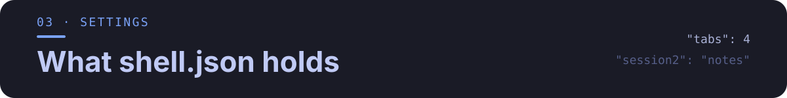
</p>

<p align="center">
  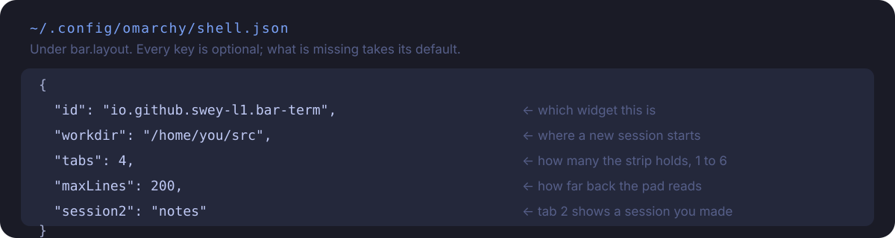
</p>

<details markdown="1">
<summary>Every key</summary>

| Key | Default | What |
|---|---|---|
| `workdir` | your home directory | Where a new session starts; after that the session decides |
| `maxLines` | `200` | How far back into the session's scrollback the pad reads |
| `tabs` | `4` | How many sessions the strip holds (1-6) |
| `session1` … `session6` | blank | Which tmux session that tab shows; blank means its own `bar-term-<n>` |

```json
{ "id": "io.github.swey-l1.bar-term", "workdir": "/home/you/src", "tabs": 3 }
```

</details>

<a name="limits"></a>
<p align="center">
  
</p>

The pad reads the session's screen a few times a second and draws it as plain text, so it
is a good window onto a shell and a poor one onto a full-screen program: colours, cursor
positioning and anything that redraws itself will look flat or half-finished. Completion
menus and `Ctrl+R` render as plain rows -- readable, but not pretty.

A full-screen program also leaves no scrollback to read: it draws on the alternate screen,
which tmux keeps no history for, so there is one screenful and no more. The wheel is passed
to the program in that case, so it scrolls its own view; over a shell, the wheel scrolls
the pad's scrollback as you would expect.

It is not a limit on what you can run. The session is a real shell, and `Alt+T` is always
one key away.

<a name="using-the-shim-directly"></a>
<p align="center">
  
</p>

<p align="center">
  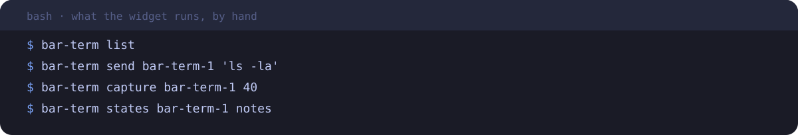
</p>

<details markdown="1">
<summary>The verbs</summary>

```bash
bar-term list                          # every session on the server
bar-term send bar-term-1 'ls -la'      # type a command into one
bar-term capture bar-term-1 40         # what the pad would be showing
bar-term states bar-term-1 notes       # a line per name: idle | running | gone
bar-term attach bar-term-1             # open a terminal on it
```

Every verb takes a session *name*, which is what lets a tab show a session it did not
make.

</details>

<p align="center">
  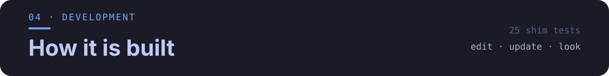
</p>

<p align="center">
  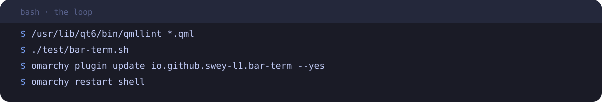
</p>

<details markdown="1">
<summary>The loop, and what is testable</summary>

```bash
/usr/lib/qt6/bin/qmllint *.qml            # QML, as far as it can see
./test/bar-term.sh                        # 36 cases against a fake tmux
omarchy plugin update io.github.swey-l1.bar-term --yes
omarchy restart shell
```

The QML never runs anything itself. `bar-term`, a plain bash script, owns every
conversation with tmux, and it is the only part with tests, because it is the only part
that can be tested without a compositor.

Each session runs `bash` with an rc file that sources your own `~/.bashrc` and adds one
thing: a `PROMPT_COMMAND` entry that writes the last exit status to a file. That is how
the pad knows a command failed without printing anything you would see, in the pad or in
an attached terminal.

More in [DEVELOPING.md](DEVELOPING.md).

</details>

<p align="center">
  <sub>MIT. See <a href="LICENSE">LICENSE</a>.</sub>
</p>

<p align="center">
  <a href="https://github.com/oil-oil/beautify-github-readme"></a>
</p>
