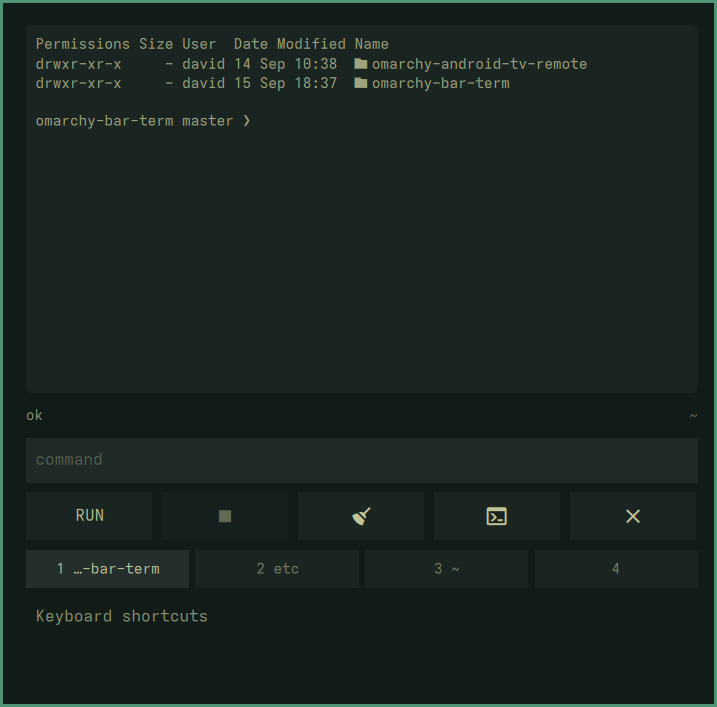
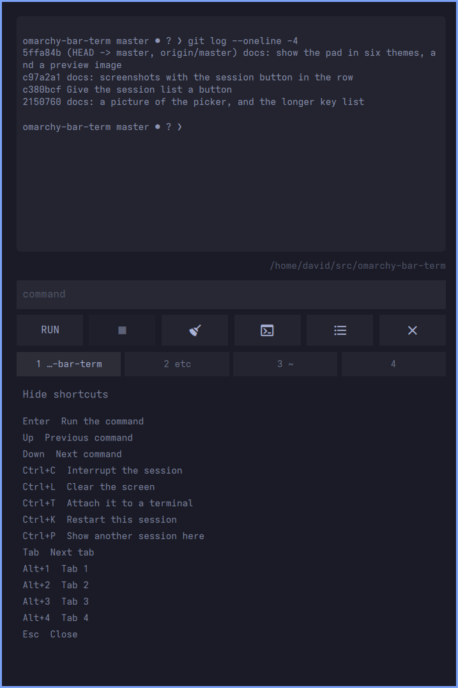
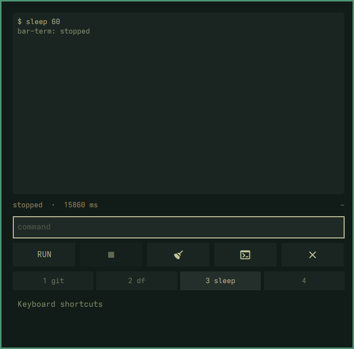

# Bar Terminal

A command line in the Omarchy bar. Click the icon, type a command, read what it said, and
carry on with whatever you were doing.

<p align="center">
  
</p>

It is for the commands that are not worth a terminal window: a `git log`, a `df -h`, a
`systemctl status`, the thing you want to check without losing the window you are in. The
icon tells you how the last one went from across the screen.

## Requirements

- Omarchy with the Quickshell-based shell (`omarchy-shell`)
- `omarchy-launch-terminal`, for handing a command to a real terminal

## Install

```bash
omarchy plugin add https://github.com/swey-l1/omarchy-bar-term --enable
omarchy restart shell
```

To remove it:

```bash
omarchy plugin remove io.github.swey-l1.bar-term
```

The plugin writes only its own entry in `shell.json`, and only when you change a setting.

## Use

Click the icon in the bar, or bind the toggle to a key:

```bash
omarchy-shell shell toggle io.github.swey-l1.bar-term
```

The prompt has the keyboard as soon as the pad opens, so you can type straight away.

| Key | What it does |
|---|---|
| `Enter` | Run the command |
| `Up` | Previous command |
| `Down` | Next command |
| `Ctrl+C` | Stop what is running |
| `Ctrl+L` | Clear the output |
| `Ctrl+T` | Open it in a terminal |
| `Esc` | Close |

Everything else you press is typing, which is why the list above is mostly modified keys.

<p align="center">
  
</p>

**Ctrl+T** is the way out of the pad's limits: it hands what you typed to a real terminal,
in the same directory, and leaves a shell open there afterwards. Use it for anything
interactive, anything that wants a password, and anything that will take a while.

## What the icon says

| Icon | Meaning |
|---|---|
| Normal | Nothing running, and the last command worked |
| Pulsing, accent colour | A command is running now |
| Urgent colour | The last command exited non-zero, or there is no shell to run commands with |

A command you stopped yourself does not count as a failure.

## Limits worth knowing

Each command runs on its own: there is no session, so `cd` in one command does not affect
the next, and nothing is interactive. A command that produces more than 64 KB is cut off,
and one that runs longer than the timeout is stopped along with everything it started.

<p align="center">
  
</p>

These are deliberate: the pad is for looking something up, and `Ctrl+T` is there for
everything else.

## Settings

Set these in `~/.config/omarchy/shell.json`, under this widget's entry in the bar layout.

| Key | Default | What |
|---|---|---|
| `workdir` | your home directory | Where commands run |
| `timeoutSec` | `20` | Stop a command after this long |
| `maxLines` | `200` | How much scrollback to keep |

```json
{ "id": "io.github.swey-l1.bar-term", "workdir": "/home/you/src", "timeoutSec": 60 }
```

## How it works

The QML never runs anything itself. `bar-term`, a plain bash script, owns running the
command, bounding its output and its time, and handing it off to a terminal; the widget
shells out to it and reads what comes back. That is also the only part with tests
(`./test/bar-term.sh`, 15 cases against a fake shell), because it is the only part that
can be tested without a compositor.

Commands run through a login shell, so they see the same `PATH` a terminal would give
them, with stdout and stderr interleaved in the order things actually happened.

## Developing

See [DEVELOPING.md](DEVELOPING.md).

## Licence

MIT.
